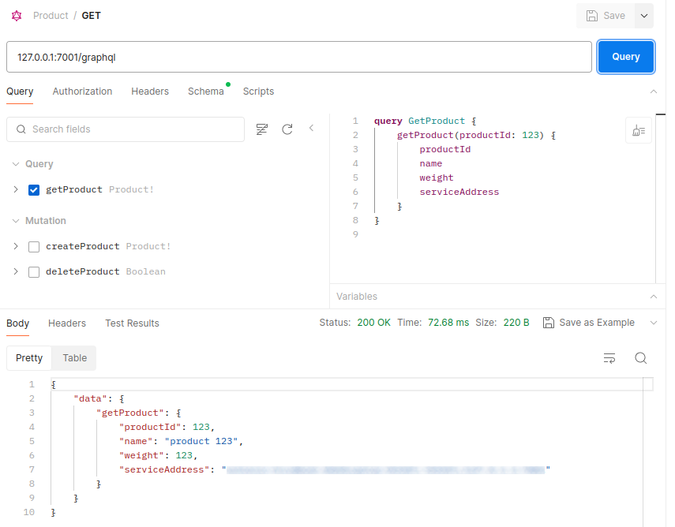

# GraphQL (ita)

## Introduction

GraphQL è un linguaggio di interrogazione per le API (Application Programming Interface), sviluppato da Facebook nel 2012 e reso open-source nel 2015.

A differenza delle tradizionali API REST, dove il client deve fare più richieste per ottenere tutte le informazioni di cui ha bisogno, GraphQL consente al client di specificare esattamente quali dati vuole ottenere e da dove, in una singola richiesta.

Con GraphQL, il client invia una query che descrive la struttura dei dati che desidera ricevere, e il server risponde con un JSON contenente solo i dati richiesti, nel formato richiesto dal client. Questo approccio permette una maggiore flessibilità e efficienza, in quanto riduce il sovraccarico di rete e consente al client di ottenere solo i dati di cui ha bisogno, senza informazioni inutili.

Inoltre, GraphQL fornisce un sistema di tipizzazione forte, che consente agli sviluppatori di definire chiaramente la struttura dei dati e di validare le query in fase di compilazione. Questo porta a una migliore documentazione automatica delle API e a una maggiore robustezza nel codice client e server.

Per esempio, volendo ottenere le informazioni riguardo ad un singolo utente, è possibile inviare la query:
```
query {
  user(id: "123") {
    id
    name
    email
    age
    posts {
      title
      body
    }
  }
}
```

In questa query:

- **`query`** è la parola chiave che indica che si sta eseguendo una query.
- **`user`** è il nome dell'endpoint della query, che potrebbe corrispondere a una funzione o a un campo definito nel server GraphQL.
- **`(id: "123")`** specifica gli argomenti della query. In questo caso, stiamo chiedendo le informazioni di un utente con un ID specifico (nel nostro esempio, "123").
- **`id`**, **`name`**, **`email`**, **`age`** sono i campi richiesti per l'utente.
- **`posts`** è un campo che può essere una lista di oggetti, che può contenere ulteriori campi come **`title`** e **`body`**, che rappresentano i post dell'utente.

Quando questa query viene eseguita sul server GraphQL, verrà restituito un oggetto JSON contenente le informazioni richieste sull'utente, come l'ID, il nome, l'email, l'età e i post, o eventualmente un errore se l'utente non viene trovato o se si verifica un altro problema durante l'esecuzione della query. Per esempio:

```json
{
  "data": {
    "user": {
      "id": "123",
      "name": "Mario Rossi",
      "email": "mario@example.com",
      "age": 30,
      "posts": [
        {
          "title": "Il mio primo post",
          "body": "Questo è il corpo del mio primo post."
        },
        {
          "title": "Secondo post",
          "body": "Questo è il corpo del mio secondo post."
        }
      ]
    }
  }
}
```

In questa risposta:

- Abbiamo un oggetto JSON con una chiave **`data`**, che contiene i dati richiesti dalla query.
- All'interno dell'oggetto **`data`**, abbiamo un oggetto **`user`**, che contiene le informazioni sull'utente richiesto.
- L'oggetto **`user`** contiene le proprietà **`id`**, **`name`**, **`email`** e **`age`**, che corrispondono alle informazioni dell'utente specificato nella query.
- La proprietà **`posts`** è un array che contiene gli oggetti post dell'utente, ognuno con i campi **`title`** e **`body`**. In questo caso, abbiamo due post restituiti.

## Technical explanation

### Schema

Lo schema GraphQL definisce la struttura dei dati disponibili attraverso un'API GraphQL. Questo schema fornisce una mappa chiara dei tipi di dati disponibili e delle relazioni tra di essi, consentendo agli sviluppatori di comprendere come interagire con l'API e quali dati possono essere richiesti e inviati. Infatti è possibile effettuare, a priori, una richiesta al fine di conoscere esso e di conseguenza gli oggetti e query disponibili.

Nello schema GraphQL, vengono definiti diversi tipi di dati, tra cui:

1. **Tipi oggetto**: Rappresentano gli oggetti all'interno del sistema. Ad esempio, un tipo oggetto potrebbe rappresentare un utente, un post o qualsiasi altra entità nel sistema.
2. **Campi**: Sono le proprietà di un tipo oggetto. Ogni campo ha un nome e un tipo. I campi possono essere scalari (stringhe, numeri, booleani, etc.) o possono essere altri tipi oggetto.
3. **Argomenti**: Sono i parametri passati ai campi per personalizzare il risultato. Ad esempio, una query per ottenere informazioni su un utente potrebbe richiedere un argomento come l'ID dell'utente.
4. **Tipi scalari**: Sono i tipi di dati primitivi, come stringhe, numeri, booleani, etc.
5. **Elenco di tipi**: Indica un array di un tipo specifico di dato. Ad esempio, un elenco di post.

Ecco un esempio semplificato di come potrebbe apparire uno schema GraphQL:

```graphql
type Product {
    productId: Int!
    name: String!
    weight: Int!
    serviceAddress: String
}

input ProductInput {
    productId: Int!
    name: String!
    weight: Int!
}

type Query {
    getProduct(productId: Int!): Product!
}

type Mutation {
    createProduct(input: ProductInput!): Product!
    deleteProduct(productId: Int!): Boolean
}
```

In questo esempio:

- E’ stato definito un tipo di oggetto: Product, che rappresenta i prodotti nel sistema.
- Ogni tipo oggetto ha dei campi che rappresentano le proprietà di quell'oggetto; con le rispettive tipologie (integer, stringhe, etc.). Il simbolo "!" in uno schema GraphQL indica che un campo è obbligatorio, ovvero deve sempre avere un valore quando viene restituito dal server GraphQL. Se un campo ha il simbolo "!", significa che non può essere nullo e deve essere incluso nel risultato della query.
- L'**`Input`** è un tipo di dato utilizzato per definire la struttura dei parametri di input per le mutazioni. Le mutazioni sono operazioni che modificano o aggiornano i dati nel server GraphQL, come ad esempio la creazione di un nuovo utente o la modifica di un post.
- Il tipo **`Query`** definisce le operazioni di lettura (queries) disponibili, come getProduct, che restituisce i dettagli del prodotto avente quello specifico *productId*.
- Le **`Mutation`** in GraphQL sono operazioni che consentono di modificare i dati sul server. Mentre le query sono utilizzate per leggere i dati, le mutazioni permettono di creare, modificare o eliminare dati nel sistema; prendono in input i parametri definiti all’interno delle parentesi tonde e restituiscono i valori della tipologia definita dopo il simbolo “:”; anche qui la presenza del simbolo “!” significa che successivamente all’esecuzione dell’operazione, essa deve restituire qualcosa diverso da *null*. Le mutazioni sono definite all'interno dello schema GraphQL proprio come le query, ma vengono annotate con il tipo **`Mutation`** anziché **`Query`**.

### Responses

Una particolarità di GraphQL, a differenza da REST, è che il codice di stato della risposta HTTP è sempre 200, indipendentemente dal fatto che la richiesta abbia avuto successo o meno. Questo perché GraphQL gestisce gli errori in modo diverso rispetto alle API REST tradizionali.

Invece di utilizzare il codice di stato HTTP per segnalare errori, GraphQL restituisce un oggetto JSON con una chiave "errors" nel corpo della risposta se si verificano errori durante l'elaborazione della query. Questo oggetto contiene una lista di errori che forniscono dettagli sul tipo di errore e su dove è avvenuto.

Ad esempio, se una query GraphQL contiene un errore di sintassi, il server risponderà con uno stato 200 e includerà un oggetto "errors" nella risposta per indicare l'errore specifico:

- **Query errata**:

    ```bash
    query GetProduct {
        getProduct(productId: 123 { # it lacks the ")" symbol after 123
            productId
            name
            weight
            serviceAddress
        }
    }
    ```

- **Risposta**:

    ```bash
    {
        "errors": [
          {
            "message": "Invalid Syntax : offending token '{' at line 2 column 31"
          }
        ]
     }
    ```


D'altra parte, se la query viene elaborata correttamente e non ci sono errori, la risposta sarà comunque uno stato 200 e includerà i dati richiesti nella risposta JSON.

Quindi, quando si lavora con GraphQL, è importante esaminare il contenuto della risposta JSON per determinare se la richiesta ha avuto successo o meno, anziché basarsi esclusivamente sul codice di stato HTTP.

## Spring boot with GraphQL

### Implementazione

Spring Boot e GraphQL possono essere combinati insieme per creare servizi web che utilizzano GraphQL come strato di query per accedere ai dati. Spring Boot offre una serie di librerie e strumenti che semplificano l'integrazione di GraphQL nelle applicazioni Java.

Al fine di una corretta implementazione, ci sono alcuni passi da seguire:

1. L’inclusione delle corrette dipendenze in Maven o Gradle.
2. La definizione dello schema con i vari tipi di oggetti, input, query e mutation.
3. L’abilitazione dell’endpoint graphql nel file *application.yml*.
4. La creazione dell’interfaccia del controller e la sua implementazione

### 1. Inclusione delle dipendenze

Nel file *build.gradle* inserire:

```bash
plugins {
    id 'org.springframework.boot' version '2.6.4'
    id 'io.spring.dependency-management' version '1.0.11.RELEASE'
    id 'java'
}

group = 'com.example'
version = '0.0.1-SNAPSHOT'
sourceCompatibility = '11'

repositories {
    mavenCentral()
}

dependencies {
    implementation 'org.springframework.boot:spring-boot-starter-web'
    implementation 'org.springframework.boot:spring-boot-starter-graphql'
    testImplementation 'org.springframework.boot:spring-boot-starter-test'
}

```

### 2. Definizione dello schema.graphqls

Al fine di definire gli oggetti, dobbiamo creare il file, con estensione `*.graphqls`, apposito che dovrà essere obbligatoriamente e senza sottocartelle inserito all’interno del path `src/main/java/resources/graphql`.

All’interno della cartella dovrà esserci un singolo file schema; è possibile splittarli nel caso di definizione di schemi diversi per applicazioni differenti che attingono alla stessa cartella *resources* andando a creare delle sottocartelle e definendo ciò nei rispettivi *application.yml (vedi dopo).*

### 3. Abilitazione endpoint graphQL

E’ necessario poi abilitare l’endpoint andando ad inserire nel file *application.yml* le voci corrette:

```yaml
spring:
  graphql:
    schema:
      locations: classpath*:graphql/**/
```

Volendo, è possibile dichiarare un classpath diverso al fine di inserire i file *.graphls in sottocartelle diverse per ragioni di comodità. In tal caso:

```yaml
spring:
  graphql:
    schema:
      locations: classpath*:graphql/product-service/**/
```

In tal caso, l’applicazione andrà a cercare il file schema all’interno della sottocartella *product-service.*

Di default, l’endpoint sarà raggiungibile all’url `$ADDRESS:$PORT/graphql`. E’ possibile modificare questo andando ad aggiungere, sempre nel *application.yml*:

```yaml
spring:
       graphql:
               path: /api/projects/graphql
```

### 4. Definizione interfaccia Java e sua implementazione

- **Interfaccia Controller**:

```java
public interface ProductController {

    @QueryMapping
    public Product getProduct(@Argument int productId);

    @MutationMapping
    public Product createProduct(@Argument Product input);

    @MutationMapping
    public Boolean deleteProduct(@Argument int productId);
}
```

Degne di nota risultano essere le annotazioni *@QueryMapping*, la quale indica che l’omonima query definita nello schema farà riferimento a tale metodo, *@MutationMapping* per quanto concerne le query di modifica ed infine *@Argument* il quale si riferisce agli attributi passati dalla query di interrogazione o dalle mutation.

- **Implementazione Interfaccia**:

```java
@Controller
public class ProductControllerImpl implements ProductController { 
    /// CODE HERE
    @Override
    public Product getProduct(@Argument int productId) {
        // CODE HERE
        return response;
    }
}
```

### Richieste

**Postman**

Con Postman il tutto risulta molto semplice in quanto esso risulta essere già predisposto per le richieste GraphQL; è sufficiente crearne una della tipologia omonima. Mettendo l’url corretto esso recupererà in maniera automatica lo schema degli oggetti, query e mutazioni e permetterà in maniera intuitiva di comporre le varie query.



**cURL**

Con esso la composizione delle richieste risulta essere più laboriosa in quanto bisogna comporre le richieste a mano:

- **Query di interrogazione**:

    ```bash
    curl --location '127.0.0.1:7001/graphql' \
    --header 'Content-Type: application/json' \
    --data '{"query":"query GetProduct { getProduct(productId: 92) { productId name weight serviceAddress } }"}'
    ```

- **Query di inserimento (*mutation*)**:

    ```bash
    curl --location '127.0.0.1:7001/graphql' \
    --header 'Content-Type: application/json' \
    --data '{"query":"mutation { createProduct(input: { productId: 92, name: \"1111\", weight: 111 }) { productId name weight } }"}'
    ```
  
## Resources

- [GraphQL](https://graphql.org/)
- [Spring for GraphQL](https://spring.io/projects/spring-graphql)
- [Building a GraphQL service](https://spring.io/guides/gs/graphql-server)
- [Getting Started with GraphQL and Spring Boot](https://www.baeldung.com/spring-graphql)
- [GraphQL vs REST](https://aws.amazon.com/it/compare/the-difference-between-graphql-and-rest/)
